# Project Explore Berkshire Data

## Project Description

This project includes reading and exploring the data without using pandas, numpy or any other advance library of data analysis.

Berkshire bike share data has been used for this project. Data has been included within the repository.

## Environment and Programming Language

* Python 2.7.14 has been used.
* Miniconda framework has been used which can be downloaded from this [link](https://repo.continuum.io/miniconda/).
* Once installed, open conda prompt.
* Create virtual environment by using `conda env create -f environment.yaml`. **environment.yaml** has been included in the repository.
* Jupyter notebook has been used for interactively analyzing and exploring the data.

## Data Description

* Data has been saved in `./jupyterwork/data/` directory.
* Data from 3 states of US (Chicago, NYC and Washington DC) has been given.
* Files are in CSV format.
* Original data is given in following links.
  * [Chicago](https://www.divvybikes.com/system-data)
  * [NYC](https://www.divvybikes.com/system-data)
  * [Washington, DC](https://www.capitalbikeshare.com/system-data)
* Data has already been collected for year 2016 and some data wrangling for inconsistent date format has already been and saved in previously mentioned link.

## Data Exploration steps

Data exploration consists of following steps.

### Data Reading

  First task is to read the data. For this **DictReader()** from **csv** library has been used.
  _Dictreader_ reads the file line by line. Function `print_first_point(filename)` takes the **filename** as input and **prints the first trip** from the file and also **returns city and first_trip**. This function split out the city name from the filename.

### Data Cleaning

  Each city has different column names with different formats and extra information as well. Details of the same has been given in iPython Notebook. So we need to clean the data with uniform formatting across the cities and also extract out the information which is required for analysis.

  The helper functions `duration_in_mins(datum, city)`, `time_of_trip(datum, city)` and `type_of_user(datum, city)` were created and used in function `condense_data(in_file, out_file, city)` which is the main function to generate the cleaned and formatted data.

  Data after cleaning has been saved to the **Summary** files given in the data folder. **DictWriter()** from the **csv** library was used to write the cleaned data to the **Summary** files for each city. **DictWriter()** writes the data line by line to the file.

### Data Analysis

  Function `number_of_trips(filename)` and returns **n_subscribers, n_customers, n_total, subscriber_proportion, customer_proportion, total_trip_time_subscribers and  total_trip_time_customers**. These variables have been used to calculate the variables **subscribers_trips, Customers_trips, total_trips, proportion_subscriber and proportion_customer** which are the python dictionaries holding the respective values for every city where city names are the keys of the dictionary.

  Function `average_trip_time(filename)` returns the following variables **average_trip_length and proportion_of_more_than_30_min**. These variables have been used to calculate **average_ride_time and proportion_of_more_than_30_mins** which are the python dictionaries holding the respective values for every city where city names are the keys of the dictionary.

  One city was chosen for analysis and analyzed to find which type of users, **customers or subscribers** takes longer rides.

### Data Visualization

  **pyplot from matplotlib library** has been used for plotting the various visualizations. Various plotting techniques like _histograms, bar plots, box plots and line plots_ are being used for visualizations.

  Function `list_of_trip_time(filename)` is used to take the filename as input and return a list of trip duration which was used to plot the histogram.

  Histogram of duration of all trips taken in Washington city was plotted and it was found that there are a few outliers with very high value of the duration so histogram was just a one tall bar as shown in image given below.

  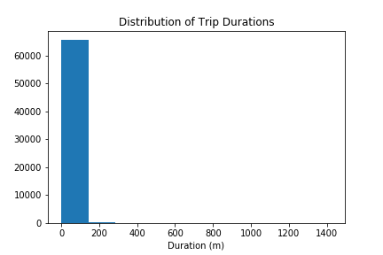

  Function `list_of_trip_time_customers_subscribers(filename)` is used to get the separate list of trip duration for both types of users and used to get the data for Washington city. Histogram was plotted by limiting the range of trip duration so that outliers have been removed and histogram can be visualized and _bins_ argument helped to get the number of bars.

  Following are the histograms of both types of subscribers.

  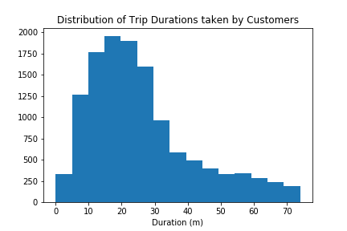 

  We can see that both histograms have single peak and also both histograms are right skewed because both histograms have right tail.

### Analysis of ridership by month

  Finally analysis of ridership by month has been analyzed. Function `ridership_by_month(filename)` returns **total_trip_time, total_trip_time_subscribers, total_trip_time_customers, total_trip_count, total_trip_count_subscribers, total_trip_count_customers and trip_list_month_wise** variables which are various values per month which are used to calculate variables **proportion_subscribers and proportion_customers** which are further used to plot the barplots.

  Following are the various bar plots.

  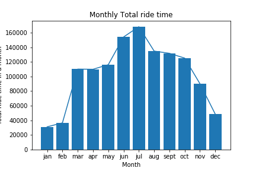
  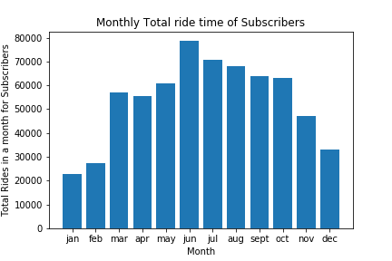
  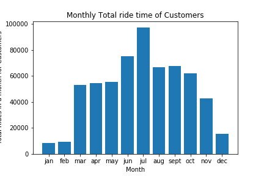
  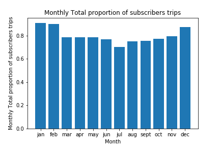
  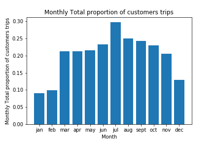
  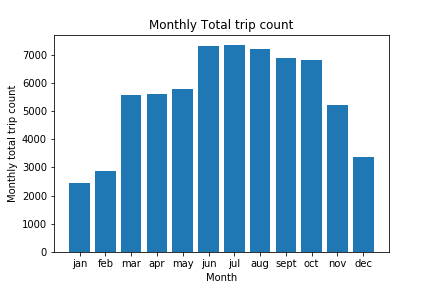
  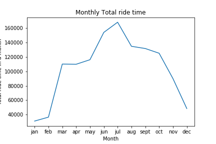

  Following are the conclusions from all the plots:
  * June and July months are having higher ride times as compared to other months and December, January and February are among the lowest total ride time.

  * Similarly Monthly total ride times for subscribers and customers follows the same trend. Bar plot is showing increasing trend from January to June and then start decreasing till January.

  * Monthly total subscribers trips are showing decreasing trend will July and then start increasing and as expected trend is reversed for Customers trips count.

  * Total trip counts per month is showing trend similar to ride times.

  * Line plot is sowing the trend clearly.

### Analysis of Trip Durations from all cities month wise

Function `dict_to_boxplot_data(data_dictionary)` is used to create a list from the dictionary containing values from all the cities. This function has been used to create a list containing Trip duration from all the cities for every month.

Following box plots have been plotted.

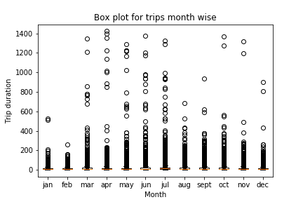
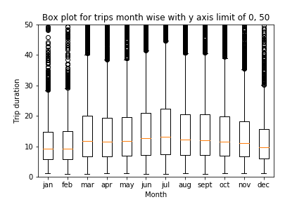

First box plots is not showing boxes at all because there are a lot of outliers and boxplots are not visible.

Limit of 50 has been put on Y-axis and boxplots are clearly visible and we can see similar trend as we saw in histograms. Trend is increasing from January to July and start decreasing till January.
